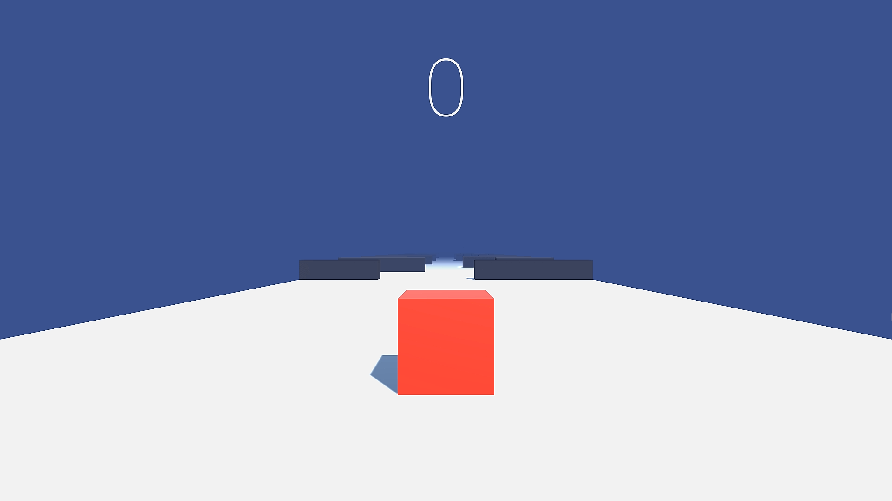
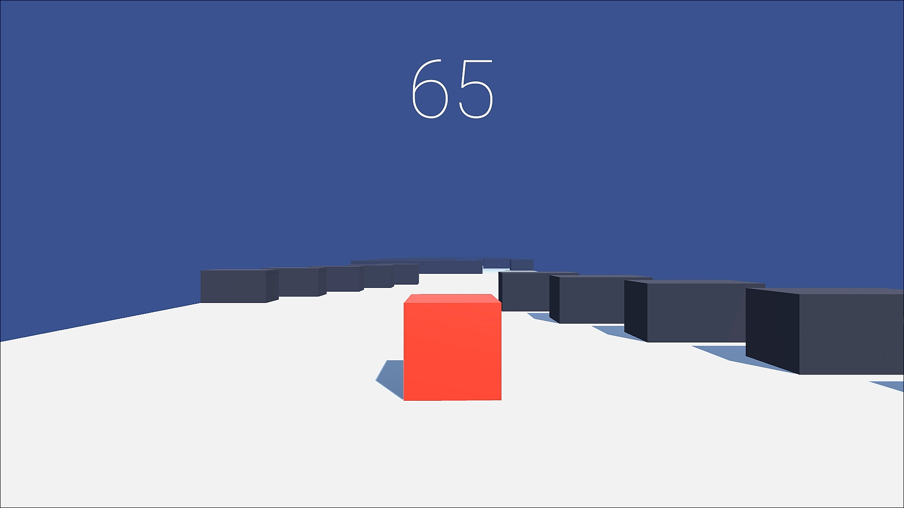
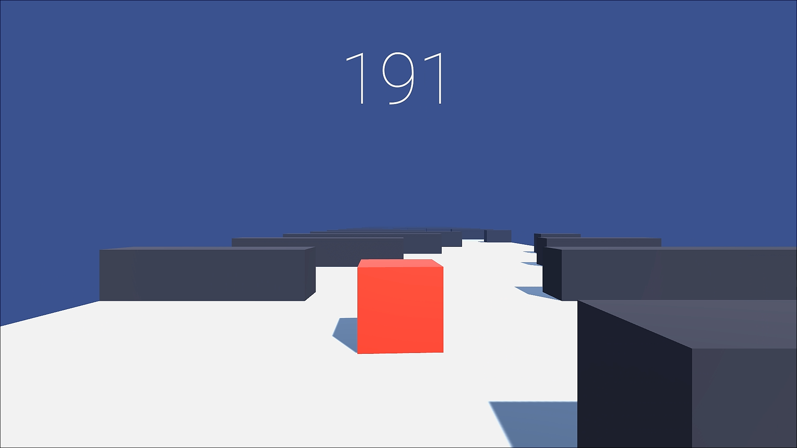
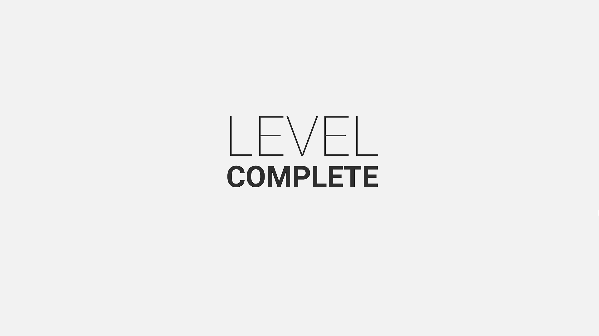
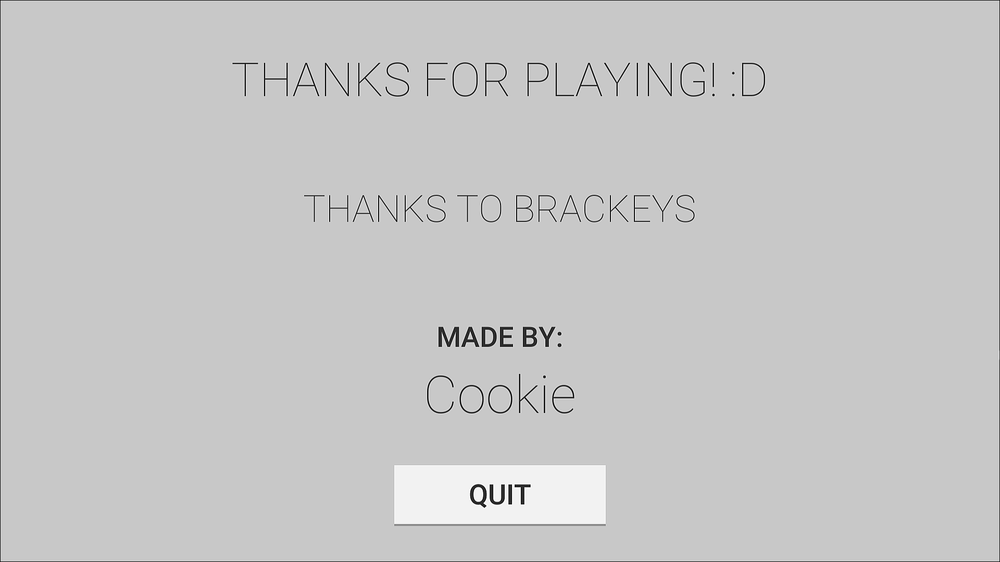

# NoobCube

  
   

 

This is my first ever game created with Unity. It has 3 levels. In each level, you have to make your way to the 
end of the level without colliding with the walls or dark objects around you. The code uses simple collission detection 
to determine if you have touched the the dark objects.

## Starting
This is the starting window of the game with only the start button.

  
   

## Progression
The game starts with 0 score. It increases as you progress through each level.

  
   

  
   

## Completing a Level
This window comes up after successfully completing a level. If you collide with the wall, the level restarts.

  
   

## Credits
This is the final window.

  
   

##
I have made the project following a YouTube tutorial (Brackeys'). Special thanks to Brackeys and Charger Games from 
YouTube for the tutorials.
